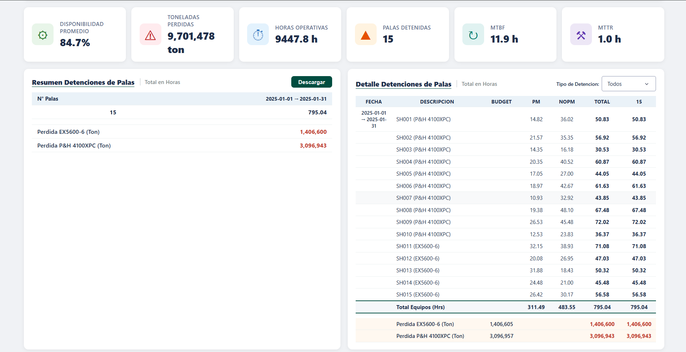

#### Si te resulta util este proyecto, apoyalo con un [](https://github.com/nrgarridoa/simultaneidad_palas/stargazers) en el repositorio.

---

# Dashboard de Simultaneidad de Palas - Monitoreo de Carguio

> **En gran mineria a cielo abierto, cada hora de pala detenida son miles de toneladas que no se mueven. En esta operacion las detenciones representan ~109.8 millones de toneladas no producidas al ano, y el 56% son demoras operativas evitables, no fallas de equipo.**

Este dashboard transforma los registros de eventos operativos de una flota de palas
en inteligencia de carguio. Permite a jefes de mina, despachadores y superintendentes
de operaciones **tomar decisiones basadas en datos** sobre la disponibilidad de los
equipos, las causas de detencion y las perdidas de produccion en cada turno.

[](https://simultaneidad-palas.onrender.com)

---

## Vista previa

| Dashboard general | Gantt Dia / Noche |
|:---:|:---:|
|  |  |

| KPIs operativos | Detalle de detenciones |
|:---:|:---:|
|  |  |

---

## Que problema resuelve

| Sin este dashboard | Con este dashboard |
|---|---|
| La disponibilidad se revisa al cierre de turno o de mes | Disponibilidad en tiempo real por pala, modelo y fecha |
| No se ve que palas operan en simultaneo ni cuales estan detenidas | Gantt dia/noche con el estado de cada equipo, hora a hora |
| Las demoras operativas se mezclan con las fallas | Separacion clara entre Demora, Malogrado (PM/NoPM) y Operativo |
| No se cuantifica la perdida de produccion | Toneladas perdidas por estado, modelo y periodo |
| Cada area maneja su propio reporte | Una sola fuente de verdad, filtrable y exportable a CSV |

---

## Hallazgos clave

Los datos revelan patrones criticos para la gestion del carguio:

**1. La disponibilidad esta al limite del benchmark**
- Disponibilidad promedio de la flota: **85.3%** (benchmark tipico 85%)
- El **14.7%** del tiempo las palas no estan produciendo (Demora + Malogrado)

**2. Las demoras operativas pesan mas que las fallas**
- Perdidas por **Demora**: **61.3M ton** (56%)
- Perdidas por **Malogrado** (fallas): **48.5M ton** (44%)
- La mayor oportunidad esta en la gestion operativa (esperas, voladura, traslados), no solo en mantenimiento

**3. El mantenimiento es mayormente reactivo**
- Detenciones **NoPM** (no programadas): **5,098 hrs**
- Detenciones **PM** (programadas): **3,450 hrs**
- Ratio ~**60/40 reactivo**: oportunidad clara para mantenimiento preventivo

**4. La flota P&H concentra la mayor perdida**
- P&H 4100XPC: **76.5M ton** perdidas (70% del total)
- EX5600-6: **33.3M ton** perdidas (30%)
- Por ser flota mayor (10 de 15 palas) y de mayor capacidad: foco para priorizar intervenciones

---

## Secciones del dashboard

### Gantt Dia / Noche
Linea de tiempo del estado de cada pala dividida en los dos turnos (Dia 08:00-20:00,
Noche 20:00-08:00). Cada barra es un bloque de estado (Operativo, Demora, Malogrado)
con tooltip de horario. Permite ver de un vistazo cuantas palas operan en simultaneo
y cuales estan detenidas en cada momento.

### KPIs operativos
Cuatro indicadores en tiempo real que responden al filtro de fecha y pala:
disponibilidad promedio, toneladas perdidas, horas operativas y numero de palas
detenidas.

### Tabla resumen de detenciones
Resumen de las palas con falla en la fecha seleccionada, con horas de detencion y
perdida de produccion desglosada por modelo de equipo.

### Tabla detalle de detenciones
Desglose por equipo con horas PM, NoPM y total, mas el budget de produccion y las
toneladas perdidas por modelo. Incluye filtro por tipo de detencion (Todos / PM / NoPM).

### Navegacion y exportacion
Navegacion por fecha con flechas, filtro multiple por pala y exportacion a CSV de los
datos filtrados.

---

## Contexto de la operacion

| Parametro | Valor |
|---|---|
| **Tipo de operacion** | Tajo abierto (open pit) |
| **Flota** | 15 palas: 10 P&H 4100XPC, 5 EX5600-6 |
| **Turnos** | Dia (08:00-20:00) y Noche (20:00-08:00) |
| **Estados** | Operativo, Demora, Malogrado (PM / NoPM) |
| **Periodo** | Ano completo 2025 (365 dias) |
| **Volumen de datos** | ~113,800 eventos operativos + 5,475 resumenes diarios |
| **Datos** | Sinteticos generados con distribuciones realistas (seed=42) |

---

## Autor

### Nilson Rolando Garrido Asenjo

**Mining Engineer | Data Analyst | Python Developer**

[](https://nrgarridoa.github.io)
[](https://www.linkedin.com/in/nrgarridoa)
[](https://www.youtube.com/@nrgarridoa)
[](mailto:nrgarridoa@gmail.com)

Ingeniero de Minas (UNC, primer puesto) y Administrador Industrial (SENATI) con trayectoria en gran mineria, industria farmaceutica y manufactura de alimentos. He liderado equipos de campo en Newmont Yanacocha, Gold Fields y Silver Mountain, dirigido proyectos tecnologicos en CODEa UNI y ejecutado consultoria de reconciliacion de mineral para Chinalco y reportabilidad operativa en gran mineria.

Mi enfoque es transformar datos operativos en inteligencia para la toma de decisiones, combinando experiencia de campo con herramientas como Power BI, Python, SQL y DAX. Piloto de drones con operaciones en superficie (fotogrametria, volumetria) y en subterranea (LiDAR con Elios 3 para Flyability). Docente de Power BI y Python aplicado a mineria.

Formacion continua en Platzi, Coursera, iSE-Latam y Netzun en analitica de datos, programacion, gestion agil de proyectos y tecnologias mineras.

[](https://github.com/nrgarridoa)

---

<details>
<summary><strong>Documentacion Tecnica (clic para expandir)</strong></summary>

## Modelo de datos

Dos datasets sinteticos que alimentan el dashboard:

| Tabla | Registros | Descripcion |
|---|---|---|
| eventos_palas | ~113,800 | Evento individual por pala: estado, subtipo, turno, hora inicio/fin, duracion, produccion y toneladas perdidas |
| resumen_palas | 5,475 | Resumen diario por pala: horas por estado, disponibilidad, produccion y perdida |

Campos principales de `eventos_palas`: `fecha`, `hora_inicio`, `hora_fin`, `pala`,
`estado`, `subtipo`, `turno`, `duracion_hrs`, `produccion_ton`, `toneladas_perdidas`,
`fecha_turno`.

## Logica de calculo (KPIs)

```
Disponibilidad %   = Horas Operativas / Horas Totales
Toneladas Perdidas = Suma de toneladas_perdidas (Demora + Malogrado)
Horas Operativas   = Suma de duracion_hrs en estado Operativo
Palas Detenidas    = Numero de palas con al menos un evento Malogrado
Budget (ton)       = Horas de detencion * tasa de produccion del modelo
```

Tasas de produccion por modelo: **P&H 4100XPC** ~5,900 ton/h (82 ton/ciclo, 50 s) y
**EX5600-6** ~5,200 ton/h (65 ton/ciclo, 45 s).

## Arquitectura

- **Frontend/back**: aplicacion **Dash** (sobre Flask) con callbacks reactivos por
  fecha, pala y tipo de detencion.
- **Visualizacion**: **Plotly** (Graph Objects + Subplots) para el Gantt dia/noche.
- **Datos**: Pandas / NumPy; la data se genera con un script de simulacion (seed=42).
- **Deploy**: **Render** con `gunicorn`. Endpoint ligero `/health` + monitor externo
  para evitar la suspension por inactividad (servicio siempre activo).

## Generacion de data sintetica

Eventos simulados por pala en ciclos de 24 h, particionados en los limites de turno
(08:00 / 20:00). Estados asignados por probabilidad (Operativo 72%, Demora 20%,
Malogrado 8%) y duraciones con distribuciones realistas (normal para Operativo y
Demora, exponencial para Malogrado). La produccion y las perdidas se calculan a partir
de los parametros de cada modelo de pala.

## Stack tecnologico

| Herramienta | Uso |
|---|---|
| **Python 3.12** | Lenguaje base |
| **Dash** | Framework web del dashboard |
| **Plotly** | Graficos interactivos (Gantt, subplots) |
| **Pandas / NumPy** | Procesamiento y generacion de datos |
| **gunicorn** | Servidor WSGI en produccion |
| **Render** | Hosting del demo en vivo |
| **Git / GitHub** | Versionamiento y publicacion |

## Codigo fuente

El codigo de la aplicacion (Dash / Python) se mantiene en un **repositorio privado**.
Esta vitrina documenta la arquitectura y permite explorar el demo en vivo; el codigo
esta **disponible para revision bajo solicitud**.

</details>

---

© 2026 Nilson Rolando Garrido Asenjo — Todos los derechos reservados. Ver [LICENSE](LICENSE).
